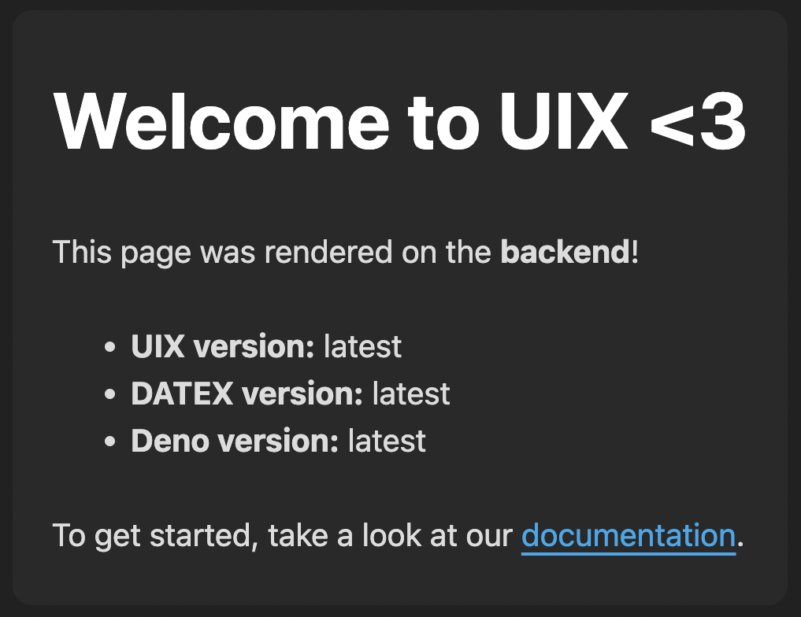

# UIX Template: Hello UIX

This repository offers a simple setup for running your first [UIX](https://github.com/unyt-org/uix) application that integrates both frontend and backend rendered content. Indeed - it is our equivalent to the famous *Hello, World!* program.



For more information, make sure to check out our [UIX Documentation](https://docs.unyt.org/manual/uix/getting-started).

## Getting Started
Make sure to install [UIX](https://docs.unyt.org/manual/uix/getting-started) and [git](https://git-scm.com/downloads) in order for the app to run.


<unyt-tabs>
<unyt-tab label="macOS" default>

```sh
curl -fsSL https://unyt.land/install.sh | bash
```

</unyt-tab>
<unyt-tab label="Windows">

```powershell
irm https://unyt.land/install.ps1 | iex
```

</unyt-tab>
<unyt-tab label="Linux">

```sh
curl -fsSL https://unyt.land/install.sh | bash
```

</unyt-tab>
</unyt-tabs>

## Running the App
Let’s launch your first app — our very own *Hello, UIX* moment:

```bash
uix --init MyFirstApp
```
When running the `uix --init` command, UIX will automatically clone this repository and launch the demo application.

*Looks too easy? But really - that is all it takes!*


## Project Structure

### Directories
The source code is split into three directories:

* The `backend` directory contains the backend logic that runs on [Deno](https://deno.com/).
* The `frontend` directory contains the code for the frontend clients (running in the web browser).
* The `common` directory contains common modules that can be initialized both in the browser and in the deno backend - they can be imported from modules in the `backend` and `frontend` directory.

The default export of the `backend/entrypoint.ts` and `frontend/entrypoint.ts` determine what content
gets displayed when visiting your app in the browser.

The directory names (`backend`, `frontend`, `common`) are important to tell UIX which code runs in which context. These names can also be changed in the [`app.dx` config file](https://docs.unyt.org/manual/uix/configuration#the-appdx-file).

### Configuration

The `app.dx` configuration file is required for a UIX app to run. It needs to contain at least the app name.
The `app.dx` has to be placed next to the app directories (`frontend`, `backend` and `common`).

### Cross realm imports

Frontend and common modules can import exported values from backend modules.
In the background, special interface module files are generated, making sure that the backend source code is never exposed to the frontend endpoints.

Access to these exports can be limited by setting DATEX permission filters.

## Development

Compiling or bundling your TypeScript or JSX files is not required. The project can be deployed as is.
There is a devcontainer setup, running the latest Deno version.

With the `--live` option, frontend browser tabs are automatically reloaded when a file has changed, which is useful for development, but should not be used in production.

This command starts the backend endpoint and also exposes a web server on port 80 or another available port.

---

<sub>&copy; unyt 2024 • [unyt.org](https://unyt.org)</sub>
